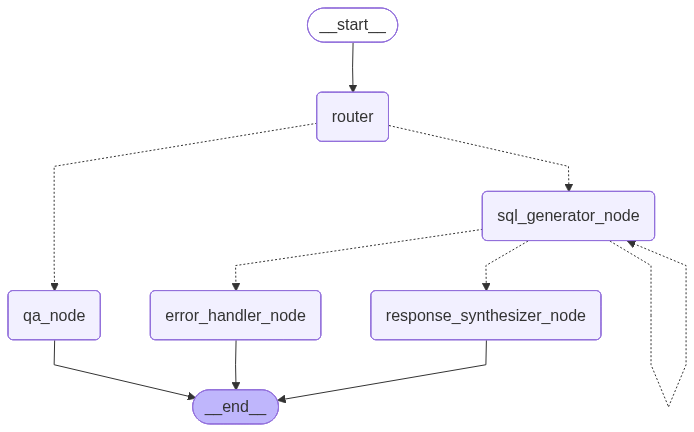

# 🏗️ Architecture Deep Dive

This document provides a comprehensive technical overview of the Analyst-9000 architecture, design decisions, and implementation details.

---

## 📊 System Overview

Analyst-9000 is a conversational AI agent built with **LangGraph** that intelligently routes user queries to either:
- **QA Bot**: For general questions and conversations
- **SQL Agent**: For data analysis queries requiring BigQuery execution



---

## 🔄 Graph Architecture

### State Machine Flow

The agent operates as a state machine. Here's what happens when a user sends a message:

1. **User Query Arrives** → The user types a question in the chatbot (e.g., *"What were the top 5 products by revenue last month?"*)

2. **Router Node** → The query first hits the **Router**, which does three things:
   - **Classifies intent**: Is this a data question (`sql_agent`) or general chat (`qa_bot`)?
   - **Reforms the query**: Resolves pronouns and context from chat history (e.g., *"them"* → *"the products we discussed"*)
   - **Generates title**: Creates a session title on the first message
   - **Has memory**: Accesses conversation history to understand context

3. **Path A — General Chat** (`qa_bot` intent):
   - Query goes to **QA Node** → Generates a conversational response with full memory of the conversation
   - Response streams back to user → **Done**

4. **Path B — Data Query** (`sql_agent` intent):
   - Query goes to **SQL Generator Node** → Converts natural language to BigQuery SQL
   - **Has memory**: Remembers previous SQL generation attempts and their errors to avoid repeating mistakes
   - SQL executes against BigQuery
   - **If successful**: Results go to **Response Synthesizer** → Transforms raw data into human-readable insights → Streams back to user → **Done**
   - **If SQL error**: Error is stored in attempt history, then retry up to 3 times with error feedback
   - **If max retries exceeded**: **Error Handler** returns a graceful failure message → **Done**

### Node Descriptions

| Node | Purpose | Temperature | Memory |
|------|---------|-------------|--------|
| **Router** | Classifies intent (`sql_agent` / `qa_bot`), reforms query for context resolution, generates session title | Fixed `0.0` | ✅ Yes |
| **QA Node** | Handles general conversation and non-data queries | User-configurable | ✅ Yes |
| **SQL Generator** | Generates BigQuery SQL from natural language | Fixed `0.0` | ✅ Yes (previous mistakes) |
| **Response Synthesizer** | Transforms SQL results into human-readable insights | User-configurable | ❌ No |
| **Error Handler** | Graceful degradation when SQL generation fails after max retries | N/A |

---

## 🧠 Model Registry

The `ModelRegistry` centralizes all LLM model instances with dynamic configuration:

```python
CONFIGURABLE_FIELDS = ["model", "temperature", "thinking_budget"]
```

### Models Used

| Model | Default | Streaming | Structured Output |
|-------|---------|-----------|-------------------|
| Router | `gemini-2.5-flash` | ❌ | ✅ (`RouterResponse`) |
| QA Model | `gemini-2.5-flash` | ✅ | ❌ |
| SQL Generator | `gemini-2.5-flash` | ❌ | ❌ |
| Response Synthesizer | `gemini-2.5-flash` | ✅ | ❌ |

### Runtime Configuration

Users can dynamically switch models and parameters via the UI:
- **Model**: Flash (fast) or Pro (more capable)
- **Temperature**: 0.0–1.0 (only affects response models)
- **Reasoning Budget**: Low/Medium/High thinking tokens

```python
THINKING_BUDGET_MAP = {
    "low": 128,
    "medium": 2500,
    "high": 10000,
}
```

---

## ⚡ Performance Optimizations

### 1. Fully Async Architecture

The entire application is async from top to bottom:

```python
# Async session store
async def get_session(self, session_id: str) -> Optional[ChatSession]:
    async with self._get_connection() as conn:
        ...

# Async graph execution
async for event in graph.stream(...):
    yield event

# Async LLM calls
response = await model.ainvoke([system_prompt] + messages, config=config)
```

> **Note**: BigQuery client is synchronous (no native async support).

### 2. Response Streaming

Real-time token streaming via Server-Sent Events (SSE):

```python
@router.post("/llm_chat_completion")
async def llm_chat_completion(request: ChatCompletionRequest):
    return StreamingResponse(
        llm_chat_completion_stream(request),
        media_type="text/event-stream",
        headers={
            "Cache-Control": "no-cache",
            "Connection": "keep-alive",
            "X-Accel-Buffering": "no",  # Disable proxy buffering
        }
    )
```

SSE Event Format:
```
data: TITLE: Revenue Analysis\n\n     # Session title (first message)
data: The top 5 products...\n\n       # Response tokens
data: [DONE]\n\n                      # Stream complete
```

### 3. Connection Pooling

Efficient database connection management for both PostgreSQL and SQLite:

```python
# PostgreSQL (via asyncpg)
self._pool = await asyncpg.create_pool(
    connection_url,
    min_size=1,
    max_size=pool_size + max_overflow,
)

# SQLite (via aiosqlite) - connection per request
async with aiosqlite.connect(self._db_path) as db:
    ...
```

Default pool configuration:
- `DB_POOL_SIZE`: 5 connections
- `DB_MAX_OVERFLOW`: 10 additional connections

---

## 📝 Structured Logging

### JSON-Formatted Logs

All logs are structured JSON for easy parsing and analysis:

```python
class JsonFormatter(logging.Formatter):
    def format(self, record: logging.LogRecord) -> str:
        data = {
            "timestamp": self.formatTime(record),
            "level": record.levelname,
            "logger": record.name,
            "message": record.getMessage(),
            "file": record.pathname,
            "line": record.lineno,
            "function": record.funcName,
            "rid": getattr(record, "correlation_id", "-"),
        }
        # ... additional fields from record
        return json.dumps(data, ensure_ascii=False)
```

### Correlation IDs

Request tracing across the entire request lifecycle:

```python
class CorrelationIdMiddleware(BaseHTTPMiddleware):
    async def dispatch(self, request, call_next):
        correlation_id = request.headers.get("X-Correlation-ID") or str(uuid.uuid4())
        with CorrelationCtx.use(correlation_id):
            response = await call_next(request)
            response.headers["X-Correlation-ID"] = correlation_id
            return response
```

### Webhook Error Notifications

Critical errors are automatically sent to a configurable webhook:

```python
class WebhookHandler(logging.Handler):
    def emit(self, record: logging.LogRecord):
        payload = json.loads(JsonFormatter().format(record))
        with httpx.Client(timeout=self.timeout) as client:
            client.post(self.webhook_url, json=payload)
```

Configure via environment variable:
```bash
WEBHOOK_URI="https://hooks.slack.com/services/..."
```

---

## 🔍 Custom LLM Monitoring

### Callback Handler

Every LLM call is instrumented with custom callbacks:

```python
class LoggingHandler(AsyncCallbackHandler):
    async def on_chat_model_start(self, ...):
        logger.info(f"🤖 {component} started", extra={
            "component": component,
            "run_id": run_id,
            "user_query": user_query[:500],
            "event": f"{component}_model_start"
        })

    async def on_llm_end(self, response, ...):
        logger.info(f"✅ {component} completed", extra={
            "component": component,
            "model_name": model_name,
            "usage_metadata": usage_metadata,  # Token counts
            "event": f"{component}_model_end"
        })

    async def on_llm_error(self, error, ...):
        logger.error(f"❌ {component} error", extra={...})
```

### LangSmith Integration

Full tracing support via LangSmith:

```python
@traceable(name="AnalystGraphExecutor", run_type="chain")
async def run(self, query, session_id, messages, ...):
    ...

@traceable(name="Router Node", run_type="chain")
async def router_node(state: AgentState):
    ...
```

Enable via environment:
```bash
LANGSMITH_TRACING=true
LANGSMITH_API_KEY=your_key
LANGSMITH_PROJECT=analyst-9000
```

---

## 🗄️ Database Architecture

### Dual Database Support

| Environment | Database | Library |
|-------------|----------|---------|
| Local Development | SQLite | `aiosqlite` |
| Docker/Production | PostgreSQL | `asyncpg` |

### Schema

```sql
CREATE TABLE chat_sessions (
    id TEXT PRIMARY KEY,
    title TEXT DEFAULT 'New Chat',
    messages TEXT NOT NULL DEFAULT '[]',  -- JSON array
    message_count INTEGER DEFAULT 0,
    created_at TIMESTAMP DEFAULT CURRENT_TIMESTAMP,
    updated_at TIMESTAMP DEFAULT CURRENT_TIMESTAMP,
    is_active BOOLEAN DEFAULT TRUE
);

CREATE INDEX idx_sessions_updated_at ON chat_sessions(updated_at DESC);
```

### Session Store API

```python
class AsyncSessionStore:
    async def get_session(session_id: str) -> ChatSession
    async def create_session(session_id: str) -> ChatSession
    async def update_session(session_id: str, updates: dict) -> ChatSession
    async def get_or_create_session(session_id: str) -> ChatSession
    async def list_sessions(limit: int, offset: int) -> List[ChatSessionSummary]
    async def delete_session(session_id: str) -> bool  # Soft delete
```

---

## 🌐 API Endpoints

### Chat API

| Method | Endpoint | Description |
|--------|----------|-------------|
| `POST` | `/chatbot/llm_chat_completion` | Streaming chat completion |
| `GET` | `/chatbot/sessions` | List all sessions |
| `GET` | `/chatbot/sessions/{id}` | Get session details |
| `DELETE` | `/chatbot/sessions/{id}` | Delete session (soft) |

### Health Check

| Method | Endpoint | Description |
|--------|----------|-------------|
| `GET` | `/health` | Application health status |

---

## 🎨 Frontend Architecture

Single-page static HTML application with:

- **Vanilla JavaScript** - No framework dependencies
- **Marked.js** - Markdown rendering with GFM support
- **SSE Client** - Real-time streaming display
- **LocalStorage** - Session persistence across page refreshes

### UI Features

- Model/temperature/reasoning configuration
- Session sidebar with history
- Markdown rendering (tables, code blocks, lists)
- Typing indicator during LLM processing
- Responsive design

---


